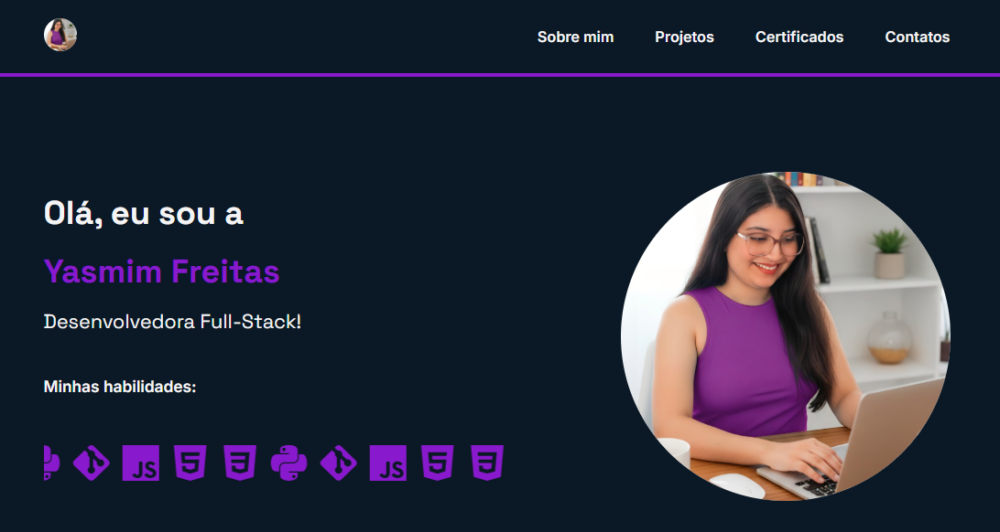

<h1 align="left"> 💜 Portfólio Pessoal — Yasmim Freitas 💜</h1>

<p align="left">
  <em>Meu espaço digital para compartilhar projetos, habilidades e minha jornada como Desenvolvedora Full-Stack.</em>
</p>


## 🌐 Demonstração



💜 Desenvolvido com dedicação por **Yasmim Freitas** 💜

🔗 **Acesse aqui:** [https://portfolio-pessoal-sigma.vercel.app](https://portfolio-pessoal-sigma.vercel.app)

---

## 🛠️ Tecnologias
<div align="left">
  
  
  
  

</div>
<br>
Este portfólio foi construído com as seguintes tecnologias e ferramentas:

- **HTML5:** Estrutura semântica e acessível.
- **CSS3:** Estilização moderna e responsiva.
- **JavaScript:** Adiciona interatividade, como o filtro de projetos e o carrossel de habilidades.
- **Git & GitHub:** Para controle de versão e colaboração.

---

## 🧩 Funcionalidades

✨ Layout moderno e **totalmente responsivo**  
🖱️ **Carrossel interativo** de ícones em JavaScript  
💬 Seções: **Sobre mim**, **Projetos**, **Habilidades** e **Contato**  
📱 Visual adaptável para **telas de celular, tablet e desktop**

---


## 📝 Licença

Este projeto está sob a licença [MIT](https://github.com/YasmimFreitas13/Portfolio_Pessoal/blob/main/LICENSE).

----

## 💻 Como executar localmente

```bash
# Clone este repositório
$ git clone [https://github.com/YasmimFreitas13/Portfolio_Pessoal.git](https://github.com/YasmimFreitas13/Portfolio_Pessoal.git)

# Acesse a pasta do projeto no terminal/cmd
$ cd Portfolio_Pessoal

# Abra o arquivo index.html no seu navegador